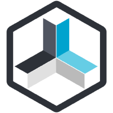

# ioBroker.repetierserver

ioBroker Adapter für Repetier-Server (3D-Drucker). Er soll die Einbindung und Steuerung eines 3D-Druckers, der über Repetier-Server läuft, in die Homeautomatisierung ermöglichen. 

Folgende Funktionen stehen zur Verfügung:

- Allgemeine Informationen zum Repetier-Server
- Erkennen und Einlesen der angelegten 3D-Drucker
- Aufbau der Kanäle und Datenpunkte entsprechend der Druckerkonfiguration 
- Ausgabe der Werte
  - Druckerkonfigurationsdaten
  - Sollwertvorgaben
  - Istwerte
  - Koordinaten
  - Statusdaten
- Steuerung des Druckers
  - Steuersignale
  - Sollwertanpassungen
- Druckauftrag
  - Informationen zum Druckobjekt
  - Informationen zum Druckauftrag
  - Zeitinformationen
- Übergabe von G-Code Befehlen
- 3D-Model-Management implementiert (V0.0.2)
  - optional in der Konfiguration wählbar
  - je nach gewählter Konfiguration werden notwendige Kanäle und Datenpunkte angelegt oder gelöscht
    - Kanal: DruckenModell
    - Datenpunkte: Modelle und Aktualisierung
  - Für jeden Drucker werden die im Repeater-Server geladenen Modelle beim Start des Adapters einmal in eine Auswahlliste geladen.
  - jede weitere Aktualisierung erfolgt über den "Aktualisierungsknopf".
  - das in der Auswahlliste angezeigte Modell ist auch das aktuelle Startmodell
  - das ausgewählte Modell wird im Namen der Starttaste angezeigt
  - es kann nur ein Druck gestartet werden - während eines Drucks wird kein weiterer Druck akzeptiert
  - Prüfen Sie vor dem Start über ioBroker, ob das Druckbett frei ist!!!

Einige Datenpunkte werden erst erstellt, wenn der 3D-Drucker aktiviert wurde bzw. der erste Druckauftrag gestartet wurde. 
Es werden nur Werte vom Drucker empfangen, wenn dieser 'aktiviert' ist!

## Konfiguration:

- IP -Adresse des Repetier-Server
- Port (default 3344)
- API-Key zum Repetier-Server
- 3D-Model-Management

**************************************

# ioBroker.repetierserver

ioBroker adapter for Repetier-Server (3D printer). It is intended to enable the integration and control of a 3D printer that runs via Repetier-Server in the home automation. 

The following functions are available:

- General information about the Repetier-Server
- Recognize and read in the created 3D printer
- Structure of the channels and data points according to the printer configuration 
- Output of the values
  - printer configuration data
  - setpoints
  - actual values
  - coordinates
  - state data
- Control the printer
  - control signals
  - Setpoint adjustments
- print job
  - Information about the print object
  - Information about the print job
  - time information
- manuel G-Code commands
- 3D-Model-Management implemented (V0.0.2)
  - optionally selectable in the configuration
  - depending on the configuration choice, necessary channels and datapoints are created or deleted
    - channel: PrintModel
    - datapoints: Modelle and Update
  - for each printer, the models loaded in the repeater server are loaded once into a selection list when the adapter is started
  - each further update is done via the "update button"
  - the model shown in the selection list is also the current start model
  - the selected model is displayed in the name of the start button
  - only one print can be started - no further print is accepted during a print
  - check before starting about ioBroker that the printbed is free!!!

Some data points are only created when the 3D printer has been activated or the first print job has started. 

## Configuration:

- IP-Adresse of the Repetier-Server
- Port of the Repetier-Server
- API-Key of then Repetier-Server
- 3D-Model-Management (checkbox yes/no)

**************************************

## Changelog

### 0.0.8

* (Baumert7269) bugfixes

### 0.0.7

* (Baumert7269) bugfixes

### 0.0.6

* (Baumert7269) Code for communication restructured
* (Baumert7269) datapoint 'Druckgeschwindigkeit' 
  - moved to Channal 'Istwerte' (Istwertanzeige)
  - Setpoint can be changed to channel 'Steuern.Werte'
  - a value adjustment in repetierserver is not converted into the datapoint 'Steuern.Werte.Druckgeschwindigkeit'
    but will come 
* (Baumert7269) datapoint 'Materialfluss' 
  - moved to Channal 'Istwerte' (Istwertanzeige)
  - Setpoint can be changed to channel 'Steuern.Werte'
  - a value adjustment in repetierserver is not converted into the datapoint 'Steuern.Werte.Druckgeschwindigkeit'
    but will come 
* (Baumert7269) Message of actions in datapoint 'Nachricht' has been extended
* (Baumert7269) Language switching has been disabled and is being rebuilt
* (Baumert7269) Adapterversion integrated as datapoint in chnnal 'info'
* (Baumert7269) A warning appears when creating datapoints, this will be fixed in the next version.

### 0.0.5

* (Baumert7269) skipped

### 0.0.4

* (Baumert7269) code for 'info.activeprinter' and 'info.activeprintjob' new designed
* (Baumert7269) new button 'server_update' for update the serverinformation manuell

### 0.0.3

* (Baumert7269) Bugfixes
  - fixed problem "Cannot read property 'val' of null"

### 0.0.2
* (Baumert7269) 3D-Model-Management implemented
  - optionally selectable in the configuration
  - depending on the configuration choice, necessary channels and datapoints are created or deleted
    - channel: PrintModel
    - datapoints: Modelle and Update
  - for each printer, the models loaded in the repeater server are loaded once into a selection list when the adapter is started
  - each further update is done via the "update button"
  - the model shown in the selection list is also the current start model
  - the selected model is displayed in the name of the start button
  - only one print can be started - no further print is accepted during a print
  - check before starting that the printbed is free!!!

* (Baumert7269) Errorcodes implemented for extruder and heatbed

* (Baumert7269) Bugfixes
  - fixed problem with 'Printer_undefined' when starting the adapter
  - fixed problem with green instance indicator when no connention to Repetier-Server

* (Baumert7269) io-package fields "connetionType" and "dataSource" integrated

* (Baumert7269) Object 'info.activeprinter' and 'info.activeprintjob' integrated

* (Baumert7269) Code cleaned up and documented

### 0.0.1
* (Baumert7269) initial release

## License

The MIT License (MIT)

Copyright (c) 2021 Baumert7269 <thomas.baumert@live.de>

Permission is hereby granted, free of charge, to any person obtaining a copy
of this software and associated documentation files (the "Software"), to deal
in the Software without restriction, including without limitation the rights
to use, copy, modify, merge, publish, distribute, sublicense, and/or sell
copies of the Software, and to permit persons to whom the Software is
furnished to do so, subject to the following conditions:

The above copyright notice and this permission notice shall be included in
all copies or substantial portions of the Software.

THE SOFTWARE IS PROVIDED "AS IS", WITHOUT WARRANTY OF ANY KIND, EXPRESS OR
IMPLIED, INCLUDING BUT NOT LIMITED TO THE WARRANTIES OF MERCHANTABILITY,
FITNESS FOR A PARTICULAR PURPOSE AND NONINFRINGEMENT. IN NO EVENT SHALL THE
AUTHORS OR COPYRIGHT HOLDERS BE LIABLE FOR ANY CLAIM, DAMAGES OR OTHER
LIABILITY, WHETHER IN AN ACTION OF CONTRACT, TORT OR OTHERWISE, ARISING FROM,
OUT OF OR IN CONNECTION WITH THE SOFTWARE OR THE USE OR OTHER DEALINGS IN
THE SOFTWARE.
